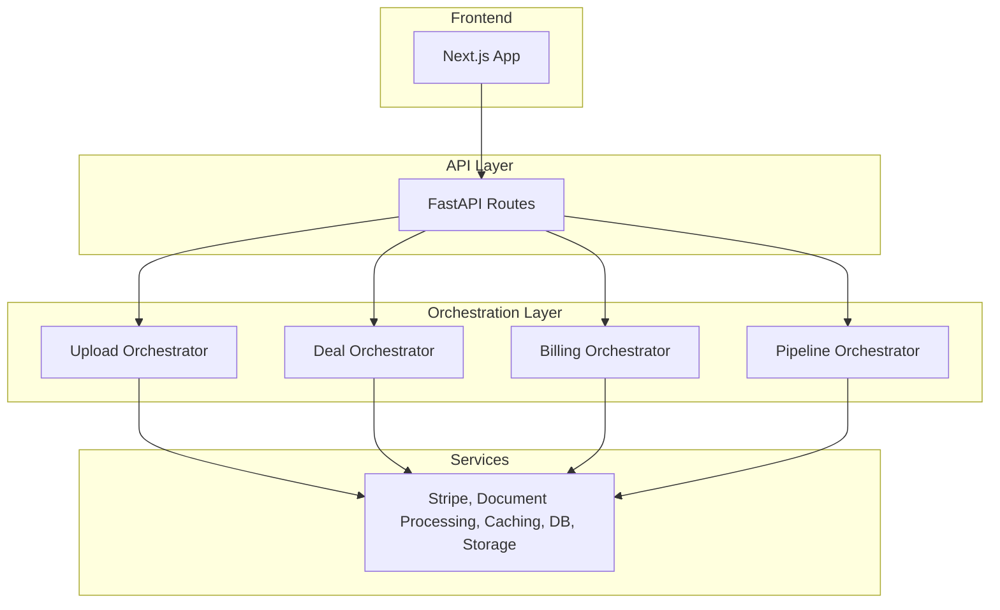
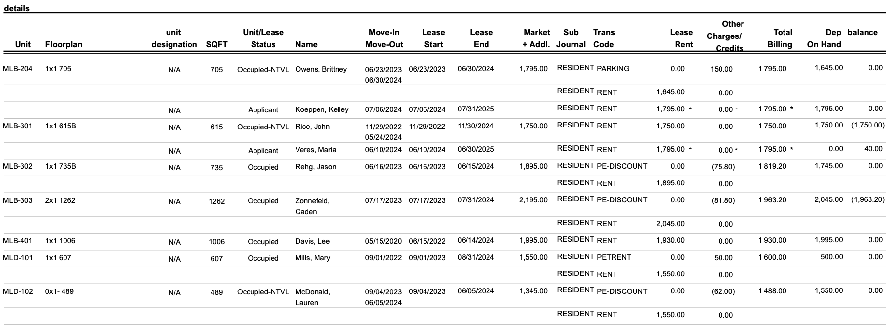

**this markdown is a work in progress

# DealQ Monorepo

Welcome to DealQ, the AI workflow platform for commercial real estate investors.

As the sole technical co-founder, I architected this codebase into production, from schema design to web app design to infra, and it was being used by multiple enterprise customers during our private beta. It was built with scale and future feature shipments in mind. The company has since wound down and I am no longer shipping feature updates.

I've stripped out sensitive IP including prompts in this sanitized codebase which exists for the purposes of showcasing my work. Below I'll walk you through the stack, architectural choices I made, and where the issues / areas of improvement are here.

## What is DealQ

The original vision for DealQ was a platform where CRE investors could access AI powered workflows to solve the most mundane and time-intensive due diligence tasks. Particularly, the one we chose to solve first is deal screening / underwriting.

A commercial real estate investor typically receives dozens of deals per week. There are three primary documents per deal, all of which are highly variable and messy:

1. The offering memorandum - a long, messy, unstructured PDF which contains the investment narrative, property details, market info, and more.

2. The rent roll - PDF or excel document that contains all the unit data and rents of the property

3. The trailing twelve statement - a PDF or excel income statement for the last twelve months at the property, which investors manually categorize based on how they underwrite deals at their firm.

The process of extracting and structuring these documents into a firm's proprietary excel model usually takes anywhere from 30 minutes to a couple of hours or more per deal, often just to find out that a deal doesn't fit the criteria for investing. DealQ's underwriting workflow cut this process down to under 10 minutes.

## Technical Challenges / Accomplishments

### 1. **AI-Powered Data Extraction Across Inconsistent Document Formats**
- **Challenge**: Extracting structured data from highly variable PDFs and Excel files with inconsistent formatting, layouts, and naming conventions across different deals
- **Solution**: Built a multi-stage pipeline utilizing a strategic mix of deterministic methods (regex patterns, structured parsing) and AI (LangChain with modular prompts) for intelligent data structuring and validation and concurrent processing for speed
- **Result**: Achieved 99% accurate data extraction across diverse document formats and building sizes, reducing manual data entry from multiple hours to under 10 minutes per deal

**I breakdown two of the most significant breakthroughs in the [Rent Roll Pipeline Section](#rent-roll-pipeline-design) here** I think this was the most interesting piece of the puzzle / demonstrates the in-depth LLM engineering required for this project.

### 2. **Data Security & User Isolation**
- **Challenge**: Ensuring secure data access and user isolation across enterprise customers in a shared database
- **Solution**: Implemented Supabase RLS policies with user-scoped data access patterns and backend endpoint authorization checks. Modularized database layer that could be transferred onto seperate DB containers for true multi-tenant architecture down the line (to support enterprise)
- **Result**: Secure data isolation supporting multiple enterprise clients with proper access controls

### 3. **Production-Ready Infrastructure**
- **Challenge**: Building a scalable, maintainable, and fault-tolerant system ready for enterprise customers
- **Solution**: Containerized application with Docker, deployed on Digital Ocean with Caddy reverse proxy, CI/CD with GitHub Actions, optimistic uploads, type safety on frontend/backend, and async processing pipelines
- **Result**: Robust production system that handled enterprise-level loads during private beta with minimal downtime

### 4. **Excel Model Integration**
- **Challenge**: Allowing users to upload and integrate their proprietary Excel models with AI-extracted data
- **Solution**: Built custom Excel generation service with dynamic model mapping and validation
- **Result**: Seamless integration between AI-extracted data and existing underwriting workflows

## Tech Stack

### Backend
- FastAPI (Python)
- LangChain for coordinating LLMs
- PyMuPDF for reading docs
- Redis for caching
- Celery + Redis for bg workers (mocked w BackgroundTasks)
- OpenPyXl for working with excel files
- Supabase S3 for storage
- Supabase for DB
- Stripe for billing

### Frontend
- Next.js (TypeScript)
- Zustand for state management
- Tailwind CSS
- AG-grid for table views
- Shad-cn / radix for primitives
- Supabase auth

### Infra
- Docker
- Digital Ocean
- Caddy
- Cloudflare
- Github actions for ci/cd

## System Architecture

## Architecture

### 1. Backend Architecture

The backend follows a clean separation of concerns:
- **Routes** → **Orchestrators** → **Services**

**Routes** are thin and only handle HTTP concerns - parsing requests, validating input, and passing data to orchestrators.

**Orchestrators** coordinate business logic by calling multiple services. For example, when processing a deal upload, the Upload Orchestrator coordinates the Document Processing Service (PDF/Excel extraction), AI Service (data structuring), and Storage Service (file management).

**Services** are pure, stateless functions that handle specific domains. Each service can be independently tested and reused across different workflows. There's no overlap between services - each has a single responsibility.

I decided on this modular architecture bc of two main benefits: (1) easy testing and maintenance since services are isolated, and (2) future flexibility to run AI workflows as individual tool calls for an agentic system. The orchestrator pattern provides a clean abstraction layer between HTTP endpoints and business logic.

### 2. Frontend Architecture

I chose **feature-based organization** on the frontend to keep related functionality together and improve maintainability as the team scales.

**Directory Structure:**
- **`/marketing`** - All pre-auth pages (landing, sign-in, pricing) separated from the main app
- **`/features`** - Feature-specific components, stores, and logic (deals, verification, billing)
- **`/components`** - Reusable UI primitives and app-wide components
- **`/lib/api`** - Centralized API actions providing a clear interface to backend capabilities. All API actions are happening server-side with "use server".

**Key Components:**
- **Custom Document Viewers** - Built PDF and Excel viewers with gesture handling for desktop. Using custom-styled radix primitives for more complex components and ShadCN elsewhere.
- **OM Viewer** (`@/features/deals/summary`) - Combines PDF viewer with AI-powered classification tooltips that link page numbers to extracted data points
- **Feature Stores** - Zustand stores scoped to features (e.g., `@/features/verification/store`) with actions, selectors, and types for clean state management that can be maintained across workflows

**Styling & UX:**
- **Tailwind CSS** for quick shipping and consistency
- **OKLCH colors** because they're cool

### Rent Roll Pipeline Design

**Challenge**: Rent rolls are notoriously messy documents with inconsistent formatting, duplicates, and multiple data points per unit that need to be distilled into clean, structured data.

**The Problem** Rent rolls contain hundreds of units, duplicate information, inconsistent formatting between buildings and row-level inconsistencies as well. See the below screenshot as an example. For the first unit MLB-204, there is data for the current resident and the future applicant (column unit lease status). Additionally, The current resident has entries for parking rent and lease rent (column trans code). The investor needs to boil this information down to just the occupying resident's information and current lease rent (no parking or discounts etc). A real estate analyst cleaning this information manually may take multiple hours. We need to create a system that can handle all sorts of inconsistencies and get the accurate information out in a structured fashion.

## Criteria

The pipeline must be:
1. **Accurate** - we need to make sure all the data that is pulled is correct
2. **Complete** - the final data must include all the relevant units and exclude duplicates and totals
3. **Consistent** - we should be getting the same result every time for the same document
4. **Stable** - large properties should not time out the LLM calls
5. **Fast** - we need to make sure this doesn't feel disruptive to the user's workflow by making them spend ten minutes on a loading screen

## The Process

I will walk you through my iterations building the rent roll pipeline. It always begins by extracting the raw text from the PDF using PyMuPDF with OCR as fallback or OpenPyXL if Excel file.

First, I tried to one-shot the structuring by passing in the raw text with a strong prompt to see how far that would get. It appeared that up to 5000 characters / 40 units it would succeed in returning all the units, but the rent numbers would be inconsistent (mixing up headers of lease rent versus market rent - we always want lease rent). For any larger property or file, the LLM would return early and leave out units or it would time out and return an error.

In the second iteration, I tried to chunk the rent roll file and process concurrently in chunks of 5000 characters (respecting row / page boundaries). While this allowed handling of large properties / files,  I ran into the issue of duplicates and totals being included since each chunk did not know what was included in the other chunks.

Then, I tried sequential processing of chunks while updating the unit count based on what was listed in the offering memorandum and force return when the count was hit, but inconsistencies across data sources made this solution very brittle, and even in situations with perfect data, it was very slow.

So, in the final version of the pipeline (after a couple more iterations), I used a strategic mix of deterministic extraction and LLM calls. It goes as follows:

1. Enumerate the raw text by pages / rows to give the LLM clear context.
2. LLM Call: pass in enumerated raw text and ask to return a JSON which identifies start/end string of the relevant data, column headers and estimated unit count (or start/end row).
3. LLM Call: As a JSON, Pass in the beginning of the file to X number of rows/characters after the start boundary, as well as X rows before the end boundary all the way to the end of the file. Have the LLM return a JSON which says if the first call was true or false, and if false, then provides the corrected boundary. This is for cases where long files return early or duplicates are being included, so that we are absolutely sure that the data boundaries are correct.
4. Using regex, we extract only the relevant data in the backend based on the LLM-defined boundaries
5. "Smart chunking" of the extracted relevant data that respects row and page boundaries and includes the column headers.
6. Since we all the raw text in the chunks is relevant, we process the chunks concurrently with LLMs
7. Combine all the LLM outputs for the final result

I tested this pipeline across hundreds of deals and refined the prompts until we achieved 99% accuracy across any type of deal or rent roll document.

## Additional win on time

For additional gain on processing time, instead of having the final LLM calls return an array of JSON objects like this:

[ {
    Unit: MLB-204,
    Floor Plan: 1 Bed
    Tenant Name: Bob Smith
    Lease Start: 01/01/2025
    Lease End: 12/31/2025
    Rent Amount: 2000
},
{
    Unit: MLB-206,
    Floor Plan: 2 Bed
    Tenant Name: Curly Jackson
    Lease Start: 02/14/2024
    Lease End: 02/13/2025
    Rent Amount: 3500
},
]

I asked them to return an array of arrays:

[
    [
     MLB-204,
     1 Bed
     Bob Smith
     01/01/2025
     12/31/2025
     2000
    ],
    [
     MLB-206,
     2 Bed
     Curly Jackson
     02/14/2024
     02/13/2025
     3500
    ]
]

**This reduced token usage by 61% on average per chunk and drastically reduced the response time by more than 50%**
