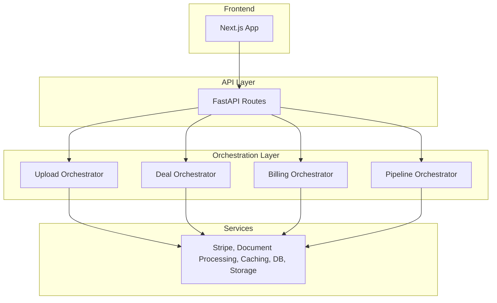

**this markdown is a work in progress

# DealQ Monorepo

Welcome to DealQ, the AI workflow platform for commercial real estate investors.

As the sole technical co-founder, I architected this codebase into production, from schema design to web app design to infra, and it was being used by multiple enterprise customers during our private beta. It was built with scale and future feature shipments in mind. The company has since wound down and I am no longer shipping feature updates.

I've stripped out sensitive IP including prompts in this sanitized codebase which exists for the purposes of showcasing my work. Below I'll walk you through the stack, architectural choices I made, and where the issues / areas of improvement are here.

## What is DealQ

The original vision for DealQ was a platform where CRE investors could access AI powered workflows to solve the most mundane and time-intensive due diligence tasks. Particularly, the one we chose to solve first is deal screening / underwriting.

A commercial real estate investor typically receives dozens of deals per week. There are three primary documents per deal, all of which are highly variable and messy:

1. The offering memorandum - a long, messy, unstructured PDF which contains the investment narrative, property details, market info, and more.

2. The rent roll - PDF or excel document that contains all the unit data and rents of the property

3. The trailing twelve statement - a PDF of excel income statement for the last twelve months at the property, which investors manually categorize based on how they underwrite deals at their firm.

The process of extracting and structuring these documents into a firm's proprietary excel model usually takes anywhere from 30 minutes to a couple of hours or more per deal, often just to find out that a deal doesn't fit the criteria for investing. DealQ's underwriting workflow cut this process down to under 10 minutes.

## Technical Challenges / Accomplishments

### 1. **AI-Powered Data Extraction Across Inconsistent Document Formats**
- **Challenge**: Extracting structured data from highly variable PDFs and Excel files with inconsistent formatting, layouts, and naming conventions across different deals
- **Solution**: Built a multi-stage pipeline utilizing a strategic mix of deterministic methods (regex patterns, structured parsing) and AI (LangChain with modular prompts) for intelligent data structuring and validation and concurrent processing for speed
- **Result**: Achieved 99% accurate data extraction across diverse document formats and building sizes, reducing manual data entry from 30+ minutes to under 10 minutes per deal

I breakdown two of the most significant breakthroughs in the pipeline sections.

### 2. **Data Security & User Isolation**
- **Challenge**: Ensuring secure data access and user isolation across enterprise customers in a shared database
- **Solution**: Implemented Supabase RLS policies with user-scoped data access patterns and backend endpoint authorization checks. Modularized database layer that could be transferred onto seperate DB containers for true multi-tenant architecture down the line (to support enterprise)
- **Result**: Secure data isolation supporting multiple enterprise clients with proper access controls

### 3. **Excel Model Integration**
- **Challenge**: Allowing users to upload and integrate their proprietary Excel models with AI-extracted data
- **Solution**: Built custom Excel generation service with dynamic model mapping and validation
- **Result**: Seamless integration between AI-extracted data and existing underwriting workflows

### 4. **Production-Ready Infrastructure**
- **Challenge**: Building a scalable, maintainable, and fault-tolerant system ready for enterprise customers
- **Solution**: Containerized application with Docker, deployed on Digital Ocean with Caddy reverse proxy, CI/CD with GitHub Actions, optimistic uploads, and async processing pipelines
- **Result**: Robust production system that handled enterprise-level loads during private beta with minimal downtime

## Tech Stack

### Backend
- FastAPI (Python)
- LangChain for coordinating LLMs
- PyMuPDF for reading docs
- Redis for caching
- Celery + Redis for bg workers
- OpenPyXl for working with excel files
- Supabase S3 for storage
- Supabase for DB
- Stripe for billing

### Frontend
- Next.js (TypeScript)
- Zustand for state management
- Tailwind CSS
- AG-grid for table views
- Shad-cn / radix for primitives
- Supabase auth

### Infra
- Docker
- Digital Ocean
- Caddy
- Cloudflare
- Github actions for ci/cd

## System Architecture

## Architecture

### 1. Backend Architecture

The backend follows a clean separation of concerns:
- **Routes** → **Orchestrators** → **Services**

**Routes** are thin and only handle HTTP concerns - parsing requests, validating input, and passing data to orchestrators.

**Orchestrators** coordinate business logic by calling multiple services. For example, when processing a deal upload, the Upload Orchestrator coordinates the Document Processing Service (PDF/Excel extraction), AI Service (data structuring), and Storage Service (file management).

**Services** are pure, stateless functions that handle specific domains. Each service can be independently tested and reused across different workflows. There's no overlap between services - each has a single responsibility.

I decided on this modular architecture bc of two main benefits: (1) easy testing and maintenance since services are isolated, and (2) future flexibility to run AI workflows as individual tool calls for an agentic system. The orchestrator pattern provides a clean abstraction layer between HTTP endpoints and business logic.

### 2. Frontend Architecture

I chose **feature-based organization** on the frontend to keep related functionality together and improve maintainability as the team scales.

**Directory Structure:**
- **`/marketing`** - All pre-auth pages (landing, sign-in, pricing) separated from the main app
- **`/features`** - Feature-specific components, stores, and logic (deals, verification, billing)
- **`/components`** - Reusable UI primitives and app-wide components
- **`/lib/api`** - Centralized API actions providing a clear interface to backend capabilities

**Key Components:**
- **Custom Document Viewers** - Built PDF and Excel viewers with gesture handling for mobile/desktop
- **OM Viewer** (`@/features/deals/summary`) - Combines PDF viewer with AI-powered classification tooltips that link page numbers to extracted data points
- **Feature Stores** - Zustand stores scoped to features (e.g., `@/features/verification/store`) with actions, selectors, and types for clean state management that can maintain state across workflows

**Styling & UX:**
- **Tailwind CSS** for quick shipping and consistency
- **OKLCH colors** because they're cool
