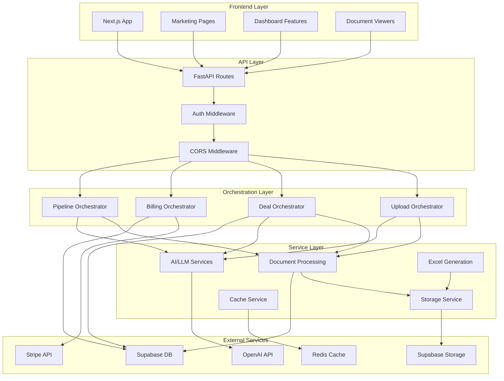

# DealQ Monorepo

Welcome to DealQ, the AI workflow platform for commercial real estate investors.

As the sole technical co-founder, I architected this codebase into production, from schema design to web app design to infra, and it was being used by multiple enterprise customers during our private beta. It was built with scale and future feature shipments in mind. The company has since wound down and I am no longer shipping feature updates.

I've stripped out sensitive IP including prompts in this sanitized codebase which exists for the purposes of showcasing my work. Below I'll walk you through the stack, architectural choices I made, and where the issues / areas of improvement are here.

## Tech Stack

### Backend
- FastAPI (Python)
- LangChain for coordinating LLMs
- PyMuPDF for reading docs
- Redis for caching
- Celery + Redis for bg workers
- OpenPyXl for working with excel files
- Supabase S3 for storage
- Supabase for DB
- Stripe for billing

### Frontend
- Next.js (TypeScript)
- Zustand for state management
- Tailwind CSS
- AG-grid for table views
- Shad-cn / radix for primitives
- Supabase auth

### Infra
- Docker
- Digital Ocean
- Caddy
- Cloudflare
- Github actions for ci/cd

## System Architecture

## Architecture

### 1. Backend Architecture

The backend is organized as follows:
- **Routes** → **Orchestrators** → **Services**

The routes are very thin and are just responsible for passing in data from the request into the orchestrator.

Orchestrators are responsible for coordinating between various services.

Each service is pure so it can be independently tested and used in various workflows. There is no overlap between services.

I decided on this modular architecture with orchestrators calling services so that eventually we could run the "AI-enabled" workflows as individual tool calls for an agentic system. The orchestrator-centered architecture lets us have a lot of flexibility in how we use all the functionalities defined in the services.

### 2. Frontend Architecture

The frontend uses feature-based grouping of logic.

All "pre-auth" (ie landing/sign-in/pricing) is located in a root directory called "marketing" and the rest of the features are in their respective directories in "features".

All API actions are defined in `@/lib/api` so we have a central directory of what is possible from the frontend.

App-wide components and all primitives are located in `@/components`. This includes custom viewers for PDF and Excel documents. My favorite component is the OM viewer in `@/features/deals/summary`. It combines the custom PDF viewer with gesture handling and includes the classification tooltip which connects page numbers to the page numbers of relevant information that we derived using an LLM workflow.

For state management, we're using Zustand stores. These are mostly defined at the feature level so that relevant information is retained across the lifespan of a workflow. See `@/features/verification/store` for an example of how I structured the store (actions, selectors, types, and store).

Using tailwind for styling due to simplicity. Using OKLCH values for colors because they're cool.

### 3. Deployment Infrastructure

Originally started by running the backend and frontend as two services on Render. When I had more time, moved over to two containers deployed on a single DO droplet (never needed more because we didn't end up going past the private beta). Using caddy for reverse proxy so the ports aren't exposed and then have cloudflare proxy set up on DNS. Using github actions to deploy.
